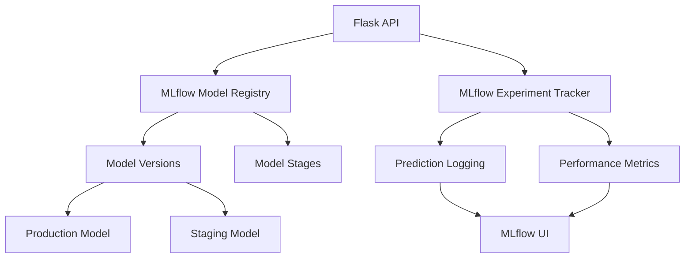

# MLflow Model Registry and Tracking Integration Guide

## 🎯 Overview

This guide explains how MLflow is integrated into the California Housing API for comprehensive model versioning, experiment tracking, and production model management.

## 🏗️ Architecture

### MLflow Components Integration



### Key Features

1. **Model Registry Integration**
   - Automatic model loading from MLflow registry
   - Model version management
   - Stage transitions (Development → Staging → Production)
   - Model metadata tracking

2. **Experiment Tracking**
   - Prediction logging and batching
   - Performance metrics tracking
   - Model comparison and evaluation
   - Real-time monitoring

3. **Production Model Management**
   - Hot model reloading without service restart
   - Fallback to local model files
   - Model health monitoring
   - Automated deployment workflows

## 🚀 Getting Started

### 1. Start MLflow Server

```bash
# Start MLflow tracking server
mlflow ui --backend-store-uri sqlite:///mlruns/mlflow.db --default-artifact-root ./mlruns --host 0.0.0.0 --port 5000

# Or using Docker Compose
docker-compose up mlflow
```

### 2. Train and Register Models

```bash
# Train models and register in MLflow
python src/models/train.py

# This will:
# - Train multiple models (Linear Regression, Decision Tree)
# - Log experiments to MLflow
# - Register best model in MLflow registry
# - Save fallback model file
```

### 3. Configure API for MLflow

```yaml
# config/mlflow_config.yaml
mlflow:
  enabled: true
  tracking_uri: "http://localhost:5000"
  model:
    name: "california_housing_best_model"
    stage: "Production"
  experiment:
    name: "california_housing_api"
    batch_size: 10
```

### 4. Start API with MLflow Integration

```bash
# Start API with MLflow integration
python src/api/app.py

# The API will:
# - Initialize MLflow connection
# - Load model from registry (fallback to local file)
# - Enable prediction tracking
# - Start health monitoring
```

## 📊 API Endpoints

### Model Management

#### Get Model Information
```bash
GET /api/model/info
```

**Response:**
```json
{
  "model_info": {
    "model_loaded": true,
    "model_metadata": {
      "name": "california_housing_best_model",
      "version": "3",
      "stage": "Production",
      "model_uri": "models:/california_housing_best_model/3"
    },
    "mlflow_enabled": true,
    "registry_info": {
      "name": "california_housing_best_model",
      "latest_versions": {
        "Production": "3",
        "Staging": "4"
      }
    }
  }
}
```

#### Reload Model from Registry
```bash
POST /api/model/reload
Content-Type: application/json

{
  "force_mlflow": true
}
```

### MLflow Registry Management

#### List Registered Models
```bash
GET /api/mlflow/models
```

**Response:**
```json
{
  "registered_models": [
    {
      "name": "california_housing_best_model",
      "creation_timestamp": 1691234567890,
      "latest_versions": {
        "Production": "3",
        "Staging": "4"
      }
    }
  ],
  "count": 1
}
```

#### Get Model Details
```bash
GET /api/mlflow/models/california_housing_best_model
```

#### Transition Model Stage
```bash
POST /api/mlflow/models/california_housing_best_model/transition
Content-Type: application/json

{
  "version": "4",
  "stage": "Production",
  "archive_existing": true
}
```

### Enhanced Prediction Endpoints

#### Single Prediction with MLflow Tracking
```bash
POST /api/predict
Content-Type: application/json

{
  "longitude": -122.23,
  "latitude": 37.88,
  "housing_median_age": 41.0,
  "total_rooms": 880.0,
  "total_bedrooms": 129.0,
  "population": 322.0,
  "households": 126.0,
  "median_income": 8.3252,
  "ocean_proximity": "NEAR BAY"
}
```

**Enhanced Response:**
```json
{
  "prediction": 452600.0,
  "model_version": "3",
  "model_name": "california_housing_best_model",
  "timestamp": "2025-08-06T10:30:00Z",
  "processing_time_ms": 15.2,
  "mlflow_logged": true
}
```

## 🔧 Configuration

### Environment Variables

```bash
# MLflow Configuration
export MLFLOW_TRACKING_URI="http://localhost:5000"
export MLFLOW_ENABLED="true"
export MLFLOW_MODEL_NAME="california_housing_best_model"
export MLFLOW_MODEL_STAGE="Production"
export MLFLOW_BATCH_SIZE="10"

# API Configuration
export MODEL_PATH="models/model.pkl"
export PORT="5001"
```

### Configuration File

```yaml
# config/mlflow_config.yaml
mlflow:
  enabled: true
  tracking_uri: "http://localhost:5000"
  
  model:
    name: "california_housing_best_model"
    stage: "Production"
    fallback_path: "models/model.pkl"
    reload_interval: 3600
    
  experiment:
    name: "california_housing_api"
    auto_log: true
    batch_size: 10
    
  monitoring:
    track_drift: true
    alert_thresholds:
      response_time_ms: 1000
      error_rate_percent: 5.0
```

## 📈 MLflow Experiment Tracking

### Automatic Logging

The API automatically logs:

1. **Prediction Data**
   - Input features
   - Prediction values
   - Processing times
   - Model versions

2. **Performance Metrics**
   - Response times
   - Error rates
   - Prediction distributions
   - Model accuracy

3. **Model Metadata**
   - Model versions in use
   - Stage transitions
   - Health check results

### Batch Logging

Predictions are batched for efficient logging:

```python
# Configurable batch size
BATCH_SIZE = 10

# Automatic batch logging when threshold reached
if len(prediction_batch) >= BATCH_SIZE:
    mlflow_tracker.log_prediction_batch(prediction_batch, model_metadata)
    prediction_batch.clear()
```

## 🏥 Health Monitoring

### Enhanced Health Checks

```bash
GET /health
```

**Response with MLflow Integration:**
```json
{
  "status": "healthy",
  "model_loaded": true,
  "model_version": "3",
  "model_name": "california_housing_best_model",
  "mlflow_connection": "healthy",
  "registry_access": "healthy",
  "uptime_seconds": 3600
}
```

### Health Check Components

1. **Model Status**
   - Model loaded successfully
   - Model version and metadata
   - Model performance metrics

2. **MLflow Connection**
   - Tracking server connectivity
   - Registry access
   - Experiment logging status

3. **System Health**
   - API response times
   - Database connectivity
   - Resource utilization

## 🔄 Model Deployment Workflow

### 1. Development Phase

```bash
# Train new model
python src/models/train.py

# Model automatically logged to MLflow as version N
# Stage: None (development)
```

### 2. Staging Phase

```bash
# Transition to staging
curl -X POST http://localhost:5001/api/mlflow/models/california_housing_best_model/transition \
  -H "Content-Type: application/json" \
  -d '{"version": "N", "stage": "Staging"}'

# Test in staging environment
# Monitor performance metrics
```

### 3. Production Deployment

```bash
# Transition to production
curl -X POST http://localhost:5001/api/mlflow/models/california_housing_best_model/transition \
  -H "Content-Type: application/json" \
  -d '{"version": "N", "stage": "Production", "archive_existing": true}'

# Hot reload in production API
curl -X POST http://localhost:5001/api/model/reload \
  -H "Content-Type: application/json" \
  -d '{"force_mlflow": true}'
```

## 📊 Monitoring and Observability

### MLflow UI

Access the MLflow UI at `http://localhost:5000` to:

1. **View Experiments**
   - Prediction logging runs
   - Model performance metrics
   - Parameter comparisons

2. **Manage Model Registry**
   - View model versions
   - Manage stage transitions
   - Compare model performance

3. **Monitor Production Models**
   - Real-time prediction logs
   - Performance trends
   - Model drift detection

### Prometheus Metrics

Enhanced Prometheus metrics with MLflow integration:

```
# Model version metrics
housing_api_model_version{name="california_housing_best_model", stage="Production"} 3

# MLflow connection status
housing_api_mlflow_connection_status 1

# Prediction logging metrics
housing_api_predictions_logged_total 1250
housing_api_mlflow_batch_logs_total 125
```

## 🧪 Testing MLflow Integration

### Run Integration Tests

```bash
# Test MLflow components
python test_mlflow_integration.py

# Expected output:
# ✅ MLflow Initialization
# ✅ Model Registry
# ✅ Model Loading
# ✅ Experiment Tracking
# ✅ API Integration
# ✅ Prediction with MLflow
```

### Manual Testing

```bash
# 1. Test model registry
curl http://localhost:5001/api/mlflow/models

# 2. Test model info
curl http://localhost:5001/api/model/info

# 3. Test prediction with tracking
curl -X POST http://localhost:5001/api/predict \
  -H "Content-Type: application/json" \
  -d '{"longitude": -122.23, "latitude": 37.88, "housing_median_age": 41.0, "total_rooms": 880.0, "total_bedrooms": 129.0, "population": 322.0, "households": 126.0, "median_income": 8.3252, "ocean_proximity": "NEAR BAY"}'

# 4. Check MLflow UI for logged predictions
# Open http://localhost:5000
```

## 🚨 Troubleshooting

### Common Issues

#### 1. MLflow Server Not Running
```bash
# Error: ConnectionError
# Solution: Start MLflow server
mlflow ui --host 0.0.0.0 --port 5000
```

#### 2. No Models in Registry
```bash
# Error: Model not found
# Solution: Train and register models
python src/models/train.py
```

#### 3. API Falls Back to Local Model
```bash
# Warning: Failed to load from MLflow registry
# Check: MLflow server running, model exists in registry
# API automatically falls back to local model file
```

#### 4. Prediction Logging Fails
```bash
# Error: MLflow tracking failed
# Check: Experiment name, tracking URI configuration
# Predictions still work, just not logged to MLflow
```

### Debug Mode

Enable debug logging:

```bash
export LOG_LEVEL="DEBUG"
export MLFLOW_ENABLED="true"
python src/api/app.py
```

## 🎯 Best Practices

### 1. Model Versioning
- Always register models with meaningful names
- Use semantic versioning for model versions
- Document model changes and improvements
- Maintain backward compatibility

### 2. Stage Management
- Test thoroughly in Staging before Production
- Use automated testing for stage transitions
- Monitor performance after deployments
- Keep previous Production version as backup

### 3. Monitoring
- Set up alerts for model performance degradation
- Monitor prediction distributions for drift
- Track response times and error rates
- Regular model performance evaluation

### 4. Security
- Secure MLflow server with authentication
- Use HTTPS for production deployments
- Implement API key authentication
- Monitor access logs and audit trails

## 📚 Additional Resources

- [MLflow Documentation](https://mlflow.org/docs/latest/index.html)
- [Model Registry Guide](https://mlflow.org/docs/latest/model-registry.html)
- [MLflow Tracking](https://mlflow.org/docs/latest/tracking.html)
- [Production Deployment](https://mlflow.org/docs/latest/deployment/index.html)
